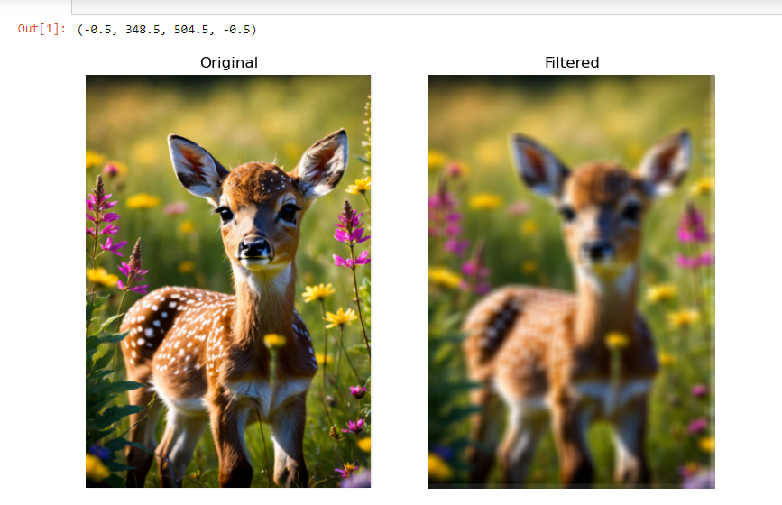
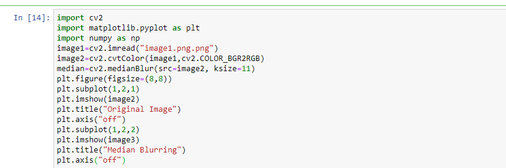

# Implementation-of-filter
## Aim:
To implement filters for smoothing and sharpening the images in the spatial domain.

## Software Required:
Anaconda - Python 3.7

## Algorithm:
# Step1:
Import necessary libraries: OpenCV, NumPy, and Matplotlib.Read an image, convert it to RGB format, define an 11x11 averaging kernel, and apply 2D convolution filtering.Display the original and filtered images side by side using Matplotlib.

# Step2:
Define a weighted averaging kernel (kernel2) and apply 2D convolution filtering to the RGB image (image2).Display the resulting filtered image (image4) titled 'Weighted Averaging Filtered' using Matplotlib's imshow function.

# Step3:
Apply Gaussian blur with a kernel size of 11x11 and standard deviation of 0 to the RGB image (image2).Display the resulting Gaussian-blurred image (gaussian_blur) titled 'Gaussian Blurring Filtered' using Matplotlib's imshow function.

# Step4:
Apply median blur with a kernel size of 11x11 to the RGB image (image2).Display the resulting median-blurred image (median) titled 'Median Blurring Filtered' using Matplotlib's imshow function.

# Step5:
Define a Laplacian kernel (kernel3) and perform 2D convolution filtering on the RGB image (image2).Display the resulting filtered image (image5) titled 'Laplacian Kernel' using Matplotlib's imshow function.

# Step 6:
Apply the Laplacian operator to the RGB image (image2) using OpenCV's cv2.Laplacian function.Display the resulting image (new_image) titled 'Laplacian Operator' using Matplotlib's imshow function.

## Program:
### Developed By   :MARELLA HASINI
### Register Number:212223240083
</br>

### 1. Smoothing Filters

i) Using Averaging Filter
```Python
import cv2
import matplotlib.pyplot as plt
import numpy as np
image1=cv2.imread("image1.png.png")
image2=cv2.cvtColor(image1,cv2.COLOR_BGR2RGB)
kernel=np.ones((11,11),np.float32)/121
image3=cv2.filter2D(image2,-1,kernel)


plt.figure(figsize=(9,9))
plt.subplot(1,2,1)
plt.imshow(image2)
plt.title("Original")
plt.axis("off")

plt.subplot(1,2,2)
plt.imshow(image3)
plt.title("Filtered")
plt.axis("off")

```
ii) Using Weighted Averaging Filter
```Python
import cv2
import matplotlib.pyplot as plt
import numpy as np
image1=cv2.imread("image1.png.png")
image2=cv2.cvtColor(image1,cv2.COLOR_BGR2RGB)
kernel2=np.array([[1,2,1],[2,4,2],[1,2,1]])/16
image3=cv2.filter2D(image2,-1,kernel2)

plt.figure(figsize=(8,8))
plt.subplot(1,2,2)
plt.imshow(image2)
plt.title("Original Image")
plt.axis("off")

plt.subplot(1,2,2)
plt.imshow(image3)
plt.title("Weighted Average Filter Image")
plt.axis("off")

```
iii) Using Gaussian Filter
```Python
import cv2
import matplotlib.pyplot as plt
import numpy as np
image1=cv2.imread("image1.png.png")
image2=cv2.cvtColor(image1,cv2.COLOR_BGR2RGB)
gaussian_blur=cv2.GaussianBlur(src=image2, ksize=(11,11),sigmaX=0, sigmaY=0)


plt.figure(figsize=(9,9))
plt.subplot(1,2,1)
plt.imshow(image2)
plt.title("Original")
plt.axis("off")

plt.subplot(1,2,2)
plt.imshow(image3)
plt.title("Gaussian Blurring")
plt.axis("off")

```

iv) Using Median Filter
```Python
import cv2
import matplotlib.pyplot as plt
import numpy as np
image1=cv2.imread("image1.png.png")
image2=cv2.cvtColor(image1,cv2.COLOR_BGR2RGB)
median=cv2.medianBlur(src=image2, ksize=11)
plt.figure(figsize=(8,8))
plt.subplot(1,2,1)
plt.imshow(image2)
plt.title("Original Image")
plt.axis("off")
plt.subplot(1,2,2)
plt.imshow(image3)
plt.title("Median Blurring")
plt.axis("off")

```

### 2. Sharpening Filters
i) Using Laplacian Kernal
```Python
import cv2
import matplotlib.pyplot as plt
import numpy as np
image1=cv2.imread("image1.png.png")
image2=cv2.cvtColor(image1,cv2.COLOR_BGR2RGB)
kernel=np.ones((11,11),np.float32)/121
image3=cv2.filter2D(image2,-1,kernel)
kernel2=np.array([[0,1,0],[1,-4,1],[0,1,0]])
image3=cv2.filter2D(image2,-1,kernel2)
plt.figure(figsize=(8,8))
plt.subplot()
plt.imshow(image2)
plt.title("Original Image")
plt.axis("off")
plt.subplot(1,2,2)
plt.imshow(image3)
plt.title("Laplacian kernel")
plt.axis("off")

```
ii) Using Laplacian Operator
```Python
import cv2
import matplotlib.pyplot as plt
import numpy as np
image1=cv2.imread("image1.png.png")
image2=cv2.cvtColor(image1,cv2.COLOR_BGR2RGB)
kernel=np.ones((11,11),np.float32)/121
image3=cv2.filter2D(image2,-1,kernel)

laplacian=cv2.Laplacian(image2,cv2.CV_64F)
plt.figure(figsize=(8,8))
plt.subplot()
plt.imshow(image2)
plt.title("Original Image")
plt.axis("off")
plt.subplot(1,2,2)
plt.imshow(image3)
plt.title("Laplacian Operator")
plt.axis("off")


```

## OUTPUT:
### 1. Smoothing Filters
</br>

i) Using Averaging Filter



ii) Using Weighted Averaging Filter


iii) Using Gaussian Filter


iv) Using Median Filter



### 2. Sharpening Filters
</br>

i) Using Laplacian Kernal


ii) Using Laplacian Operator


## Result:
Thus the filters are designed for smoothing and sharpening the images in the spatial domain.
